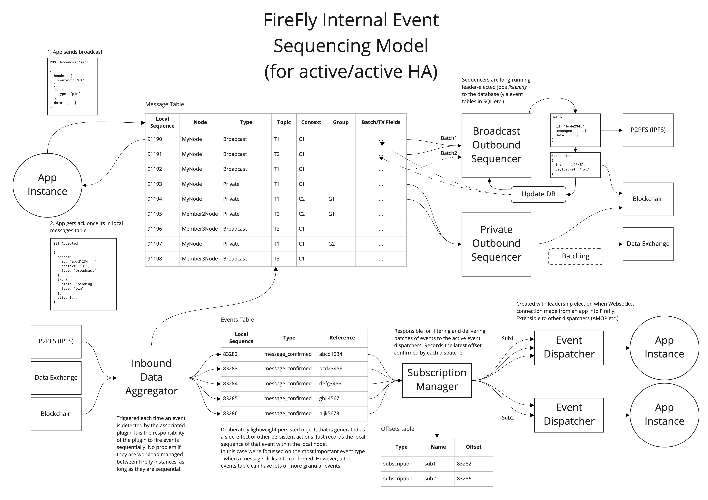

# Internal Event Sequencing
{: .no_toc }

## Table of contents
{: .no_toc .text-delta }

1. TOC
{:toc}

---

<iframe width="736" height="414" src="https://www.youtube.com/embed/JroBAfmfI_E" title="YouTube video player" frameborder="0" allow="accelerometer; autoplay; clipboard-write; encrypted-media; gyroscope; picture-in-picture" allowfullscreen></iframe>

## Overview

One of the most important roles FireFly has, is to take actions being performed by the local apps, process them, get them confirmed, and then deliver back 
as "stream of consciousness" to the application alongside all the other events that are coming into the application from other FireFly Nodes in the network.

You might observe the problems solved in this architecture are similar to those in a message queuing system (like Apache Kafka, or a JMS/AMQP provider like ActiveMQ etc.).

However, we cannot directly replace the internal logic with such a runtime - because FireFly's job is to aggregate data from multiple runtimes that behave similarly to these:
- Private messaging in the Data Exchange
- The blockchain ledger(s) themselves, which are a stream of sequenced events
- The event dispatcher delivering messages to applications that have been sequenced by FireFly

So FireFly provides the convenient REST based management interface to simplify the world for application developers, by aggregating the data from multiple locations, and delivering it to apps in a deterministic sequence.

The sequence is made deterministic:
- Globally to all apps within the scope of the ledger, when a Blockchain ledger is used to pin events (see #10)
- Locally for messages delivered through a single FireFly node into the network
- Locally for all messages delivered to applications connected to a FireFly node, across blockchain 

## App Instances

* Broadcast messages to the network
* Ingest ack when message persisted in local messages table
* Consume events via Websocket connection into FireFly

## Outbound Sequencers

* Broadcast or Private through IPFS or Private Data Storage
* Long-running leader-elected jobs listening to the database (via event tables in SQL, etc.)

## Inbound Aggregator 

* Triggered each time an event is detected by the associated plugin.
* It is the responsibility of the plugin to fire events sequentially.  Can be workload managed but **must** be sequential.

### Events Table

* Deliberately lightweight persisted object, that is generated as a byproduct of other persistent actions.
* Records the local sequence of a specific event within the local node.
* The highest level event type is the confirmation of a message, however the table can be extended for more granularity on event types.

## Subscription Manager

* Responsible for filtering and delivering batches of events to the active event dispatchers.
* Records the latest offset confirmed by each dispatcher.

## Event Dispatcher

* Created with leadership election when WebSocket connection is made from an app into FireFly.
* Extensible to other dispatchers (AMQP, etc.).
