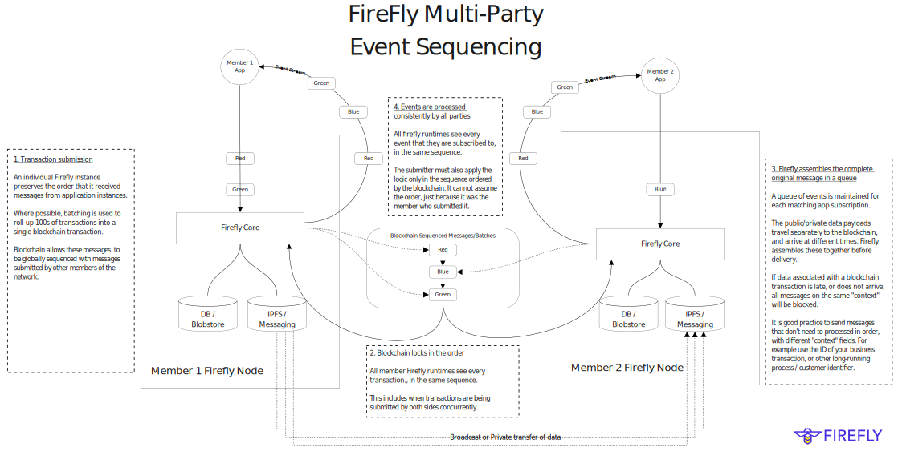

# Multiparty Event Sequencing
{: .no_toc }

## Table of contents
{: .no_toc .text-delta }

1. TOC
{:toc}

---

## Transaction Submission

* An individual FireFly instance preserves the order that it received messages from application instances.
* Where possible, batching is used to roll-up hundreds of transactions into a single blockchain transaction.
* *Blockchain allows these messages to be globally sequenced with messages submitted by other members of the network.*

## Blockchain Ordering

* All member FireFly runtimes see every transaction in the same sequence.
* *This includes when transactions are being submitted by both sides concurrently.*

## Message Assembly

* A queue of events is maintained for each matching app subscription.
* The public/private payloads travel separately to the blockchain, and arrive at different times.  FireFly assembles these together prior to delivery.
* If data associated with a blockchain transaction is late, or does not arrive, all messages on the same "context" will be blocked.
* *It is good practice to send messages that don't need to be processed in order, with different "context" fields.  For example use the ID of your business transaction, or other long-running process / customer identifier.*

## Event Processing 

* Events are processed consistently by all parties.
* All FireFly runtimes see every event that they are subscribed to, in the same sequence.
* *The submitter must also apply the logic only in the sequence ordered by the blockhain.  It cannot assume the order even if it is the member that submitted it.*
