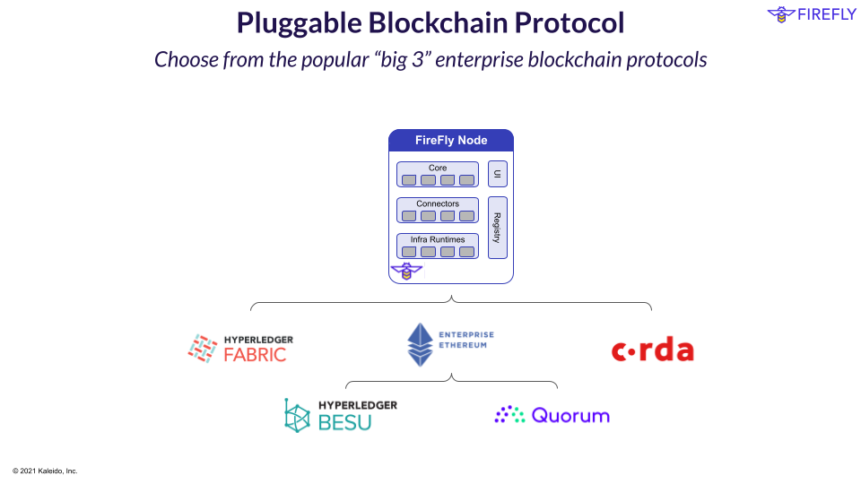

# Blockchain protocols
{: .no_toc }

## Table of contents
{: .no_toc .text-delta }

1. TOC
{:toc}

---

## Supporting multiple blockchain protocols

A blockchain DLT technology is usually the beating heart of a multi-party system, critical to the
new trust and privacy models being established.

The FireFly API provides an interface for the blockchain tier that is fully pluggable.

So you can choose the blockchain ecosystem that best meets the functional and
non-functional requirements of your business network, and still benefit from the developer
friendly APIs, event-driven programming model, and on-chain/off-chain coordination provided by FireFly.

## Core constructs and custom on-chain logic

Core blockchain programming patterns like pinning proofs to the chain, fungible tokens,
and non-fungible tokens are abstracted into a common API, so that higher level services can
be provided on top of those - such as transaction history for tokens, or on-chain/off-chain
pinning of data.

> _You can think of these a little like the core CRUD interfaces of a traditional database
> technology. They are the foundation actions that any developer needs to build a multi-party system,
> without necessarily being a blockchain specialist.
> Wherever possible, reference implementations of the on-chain logic should be used, that have been
> peer reviewed through open source collaboration and/or wide production adoption._

For fully custom smart contract logic outside of these foundation constructs, FireFly provides
a passthrough mechanism. This means your applications can use the FireFly API and reliable events
for simple access to the blockchain technology, while interacting with rich on-chain
logic.

So application developers get REST APIs that still abstract away the mechanics of how transaction
submission and events work in the low level RPC interfaces of the blockchain technologies.
However, the on-chain logic can be anything supported by the blockchain itself.

> _You can think of these a little like the stored procedures of a traditional database technology.
> These allow execution of an exact piece of logic to be performed with a deterministic outcome,
> using only data stored inside of the blockchain itself. One well established way of assuring mutual
> agreement on an outcome in a multi-party system.
> Development of custom smart contracts is usually done by a specialist
> team that understands the technology in detail. They are often subject to
> additional specialist scrutiny such as multi-party review, and external code audit._

FireFly is deliberately one step detached from the deployment, upgrade, and maintenance of this
on-chain logic. This approach applies to both the foundational constructs, and the fully custom
on-chain logic. We leave the best practice on this specialist activity to the the individual
blockchain communities. However, the CLI for developers does automate deployment of a reference
set of contracts to get you started.

A popular approach to innovation in enterprise use cases, is to make small internal customizations
to the operation of standardized peer-reviewed logic (such as token contracts), without updating
the interface. This can allow you to still give the full FireFly API experience to Web/API use
case developers (such as a cached transaction history API for tokens), while allowing the kinds of
innovation only possible by updating the logic on-chain.

## Blockchain interface plugins

Different blockchains provide different features, such as multiple separate ledgers (Fabric channels etc.)
or private transaction execution (Tessera etc.). These are mapped to high-level core constructs in the FireFly
model, but with protocol specific configuration that can be passed through from the FireFly API to the
blockchain interface.

There are sub-communities building the blockchain interfaces for each of the "big 3":

- Ethereum (Hyperledger Besu, Quorum, Go-ethereum)
  - Status: Mature
  - Repo: [hyperledger/firefly-ethconnect](https://github.com/hyperledger/firefly-ethconnect)
- Hyperledger Fabric
  - Status: Under active development
  - Repo: [hyperledger/firefly-fabconnect](https://github.com/hyperledger/firefly-fabconnect)
- Corda
  - Status: Core transactions+events proved out. Seeking contributors
  - Repo: [hyperledger/firefly-cordaconnect](https://github.com/hyperledger/firefly-cordaconnect)

> _Each FireFly network is tied to a single blockchain technology. Watch this space for
> evolution of pluggable bridges for tokens, assets and data between networks through
> FireFly plugins._

## Need help choosing the right blockchain ledger technology?

The following article might help you compare and contrast:

- [Enterprise Blockchain Protocols: A Technical Analysis of Ethereum vs Fabric vs Corda](https://www.kaleido.io/blockchain-blog/enterprise-blockchain-protocols-a-technical-analysis-of-ethereum-vs-fabric-vs-corda)
