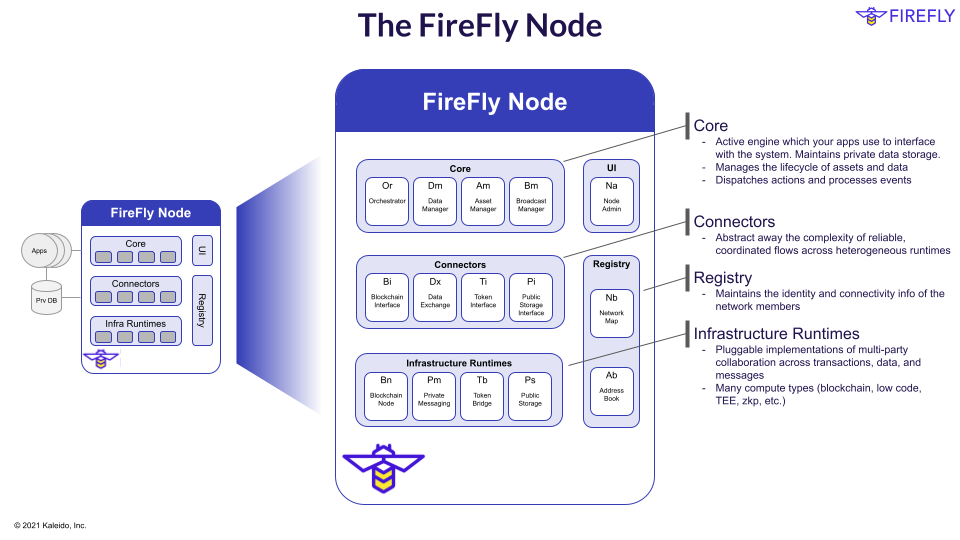

# The FireFly node
{: .no_toc }

## Table of contents
{: .no_toc .text-delta }

1. TOC
{:toc}

---

## FireFly node runtimes

A FireFly node is a collection of multiple microservice runtimes with a single unified HTTPS/Websocket API (exposed by the Core).

The minimum set of runtimes is as follows:

- FireFly Core - the API and event server for your multi-party applications
- Blockchain node - the decentralized ledger technology establishing a shared source of truth
- Blockchain interface - transaction submission and event streams for your chosen protocol
- Shared storage node - a network-wide peer-to-peer store of shared data
- Data exchange - for private member to member communications of messages and files

> _Check out the [FireFly CLI](https://github.com/hyperledger/firefly-cli) to get a
> a multi-party system running on your laptop in minutes._

## Pluggable microservices architecture

The runtimes are pluggable, allowing technology choice, and extensibility.

- FireFly Core
  - Orchestration engine - manages lifecycle of assets and data
  - Hosts the API and UI - applications connect here
  - Maintains private storage
  - Written in Go
- Connectors
  - Runtimes that bridge the core to multi-party infrastructure
  - Can be written in any language Go, Java, Node.js etc.
  - Can be stateful or stateless, depending on requirements
  - Can contain significant function, such as managed file transfer, or e2e encryption
- Infrastructure runtimes
  - Can be local runtimes, or cloud services
  - Blockchain nodes - Fabric, Ethereum, Corda etc.
  - Database servers - PostreSQL, SQLite, CouchDB etc.
  - Private messaging - Kafka, RabbitMQ, ActiveMQ, Mosquitto etc.
  - Private blob storage - Kubernetes PVCs, AWS S3, Azure File etc.
  - Public blob storage - IPFS, etc.
  - ... and more - token bridges, trusted compute engines, etc.
