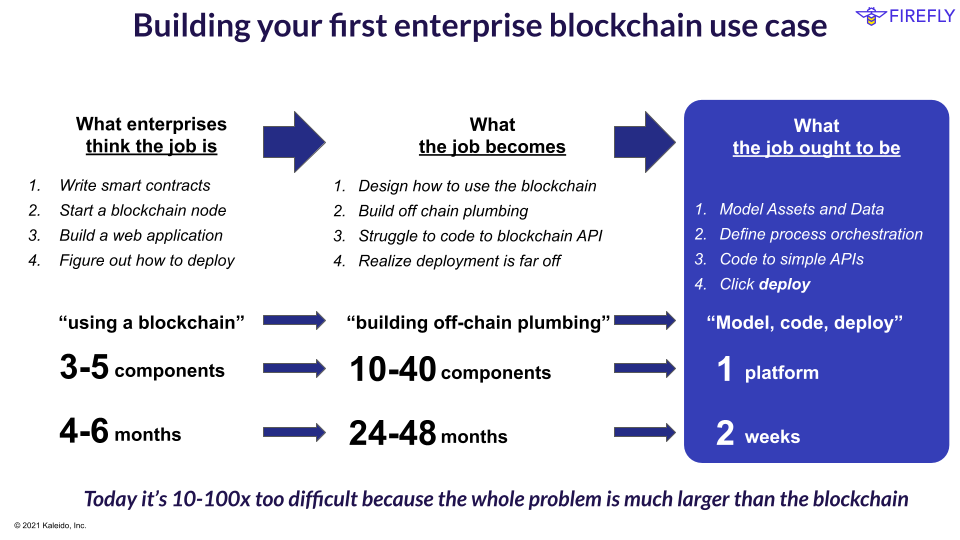

# The FireFly problem statement
{: .no_toc }

## Table of contents
{: .no_toc .text-delta }

1. TOC
{:toc}

---

## The importance of the application layer

Multi-party systems always have an application layer, and what makes them different to a third party
as-a-service centralized solution, is that each member runs a copy of that application layer.

Each member's copy of the application is integrated to their IT environment, their data, their core systems,
and their business processes.

In many multi-party systems it's common for there to be multiple applications building sharing a single
business network. As microservices solving different aspects of the overall solution, or solving
different use cases within the same group of parties - kind of like an app store.

Projects often assume the hard problems are all going to be in the blockchain/advanced
cryptography layer, and the complexity of building the application layer, private data layer,
and integration points for the individual members is underestimated.

## FireFly is for developers

The reality is there's a huge amount of "non blockchain" development that has to happen, to unlock
the potential of the new technology at the core of the multi-party system.

FireFly is designed to be the bridge developers need, so they can focus on building use cases
and business value.

To be an orchestration layer providing out-of-the-box patterns that work across multiple
use cases and industries.

FireFly is deliberately a developer centric API based approach, rather than a top-down modeling framework
(although it would a platform on which such a modeling framework could be built).

- APIs for developers building great user experience (UI/UX)
  - Designed for modern web/mobile developers - building next generation business apps
  - Built-in data explorer out of the box - for common audit and operations activities
  - With web-native websockets events to build "spinner free" experiences
- APIs for developers building modern business APIs
  - Responsive APIs that abstract complex plumbing into simple operations and JSON data types
  - A built-in state store (private cache) that records activities, and calculates the latest state
  - An event-driven model with modern interfaces - websockets, webhooks etc.
- APIs for data integration
  - For ETL or realtime integration of data from core systems
  - With modeling and enforcement on agreed (canonical) data formats
- Private off-chain data exchange - pluggable
  - For efficient application-to-application messaging
  - For large document transfer
- Transaction submission logic - pluggable
  - Generating/gathering signatures integrated with key management
  - Streaming transactions reliably to a blockchain
  - Necessary whether the logic is as simple as a pre-built token, or a bespoke crafted contract
- Event detection logic
  - Reliably detecting events from the blockchain
  - Processing these events in the correct order, with resilience
  - Necessary even when the event is as simple as a confirmation that a transaction is complete
- On-chain/off-chain coordination logic
  - Aggregating events from different sources together
  - Agreeing a global order of events, preserving privacy on who's involved
  - Correlating private data exchanges with on-chain proofs
  - Coordinating sophisticated multi-step business flows
  - Collating a stream of data/evidence together to perform an automated or business decision
