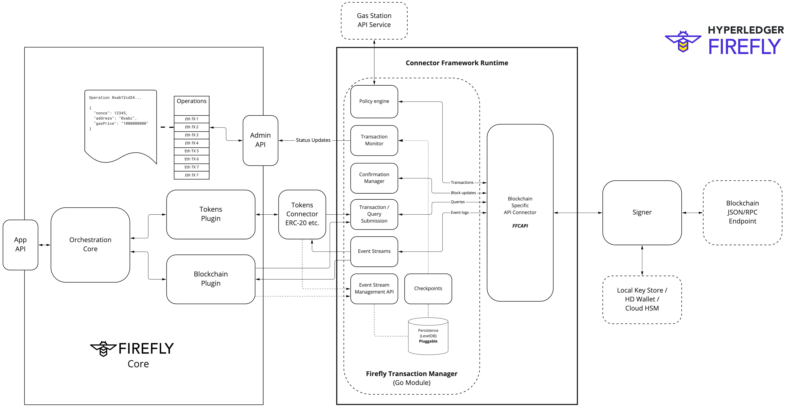

# Blockchain Connector Toolkit
{: .no_toc }

---

## FireFly architecture for public chains

One of the fastest evolving aspects of the Hyperledger FireFly ecosystem, is how it facilitates
enterprises to participate in public blockchains.

The architecture is summarized as follows:

- New **FireFly Transaction Manager** runtime
  - Operates as a microservice extension of the FireFly Core
  - Uses the `operation` resource within FireFly Core to store and update state
  - Runs as a singleton and is responsible for `nonce` assignment
  - Takes as much heavy lifting away from blockchain specific connectors as possible
- Lightweight FireFly Connector API (`ffcapi`)
  - Simple synchronous RPC operations that map to the most common operations supported across public blockchain technologies
  - Examples:
    - Find the next nonce for a given signing key
    - Serialize a transaction from a set of JSON inputs and an interface definition
    - Submit an un-signed transaction with a given gas price to the blockchain, via a signing wallet
    - Establish a new block listener
    - Poll for new blocks
    - Establish a new event log listener
    - Poll for new events
- Pluggable **Policy Engine**
  - Invoked to make decisions on transaction submission
  - Responsible for gas price calculation
  - Able to intervene and adjust the characteristics of signing/submission
  - OSS reference implementation provided with Gas Station REST API integration
- **Confirmation Manager**
  - Extracted from the Ethconnect codebase
  - Coupled to both transaction submission and event confirmation
  - Embeds an efficient block cache
- **Event Streams**
  - Extracted from the Ethconnect codebase
  - Checkpoint restart based reliable at-least-once delivery of events
  - WebSockets interface upstream to FireFly Core

This evolution involves a significant refactoring of components used for production solutions in the FireFly Ethconnect
microservice since mid 2018. This was summarized in [firefly-ethconnect#149](https://github.com/hyperledger/firefly-ethconnect/issues/149),
and cumulated in the creation of a new repository in 2022.

You can follow the progress and contribute in this repo: https://github.com/hyperledger/firefly-transaction-manager