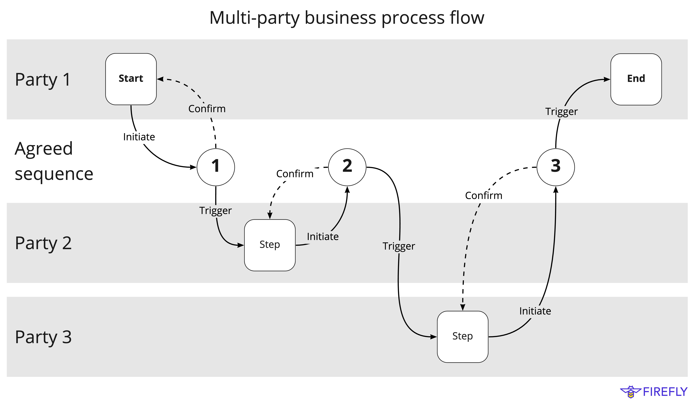

# Flows
{: .no_toc }

---

## Data flow

The reality of most web3 scenarios, is that only a small part of the overall use-case
can be represented _inside_ the blockchain or distributed ledger technology.

Some additional data flow is required.

### Non-fungible Tokens (NFTs) and hash-pinning

The data associated an NFT might be as simple as a JSON document pointing at an interesting
piece of artwork, or as complex as a set of detailed set of scans/documents representing a
_digital twin_ of a real world object.

Here the concept of a _hash pinning_ is used - allowing anyone who has a copy of the original data
to recreate the hash that is stored in the on-chain record.

The data is not on-chain, so simple data flow is required to publish/download the off-chain data.

The data might be published publicly for anyone to download, or it might be sensitive and require
a detailed permissioning flow to download.

### Dynamic NFTs and Business Transaction Flow

In an enterprise context, an NFT might have a dynamic ever-evolving trail of business transaction
data associated with it. Different parties might have different views of that business data, based
on their participation in the business transactions associated with it.

Here the NFT becomes a foreign key integrated across the core systems of a set of enterprises
working together in a set of business transactions.

The data itself needs to be downloaded, retained, processed and rendered.
Probably integrated to systems, acted upon, and used in multiple exchanges between companies
on different blockchains, or off-chain.

### Data and Transaction Flow patterns

Hyperledger FireFly provides the raw tools for building data and transaction flow patterns, such
as storing, hashing and transferring data.

It also provides the higher level flow capabilities that are needed for multiple parties to
build sophisticated transaction flows together, massively simplifying the application logic required:

- Coordinating the transfer of data off-chain with a blockchain sequencing transaction
- Batching for high throughput transfer via the blockchain and distributed storage technologies
- Managing privacy groups between parties involved in a business transaction
- Masking the relationship between blockchain transactions, for sensitive data

> Learn more in [Multiparty Process Flows](../multiparty/multiparty_flow.html)

