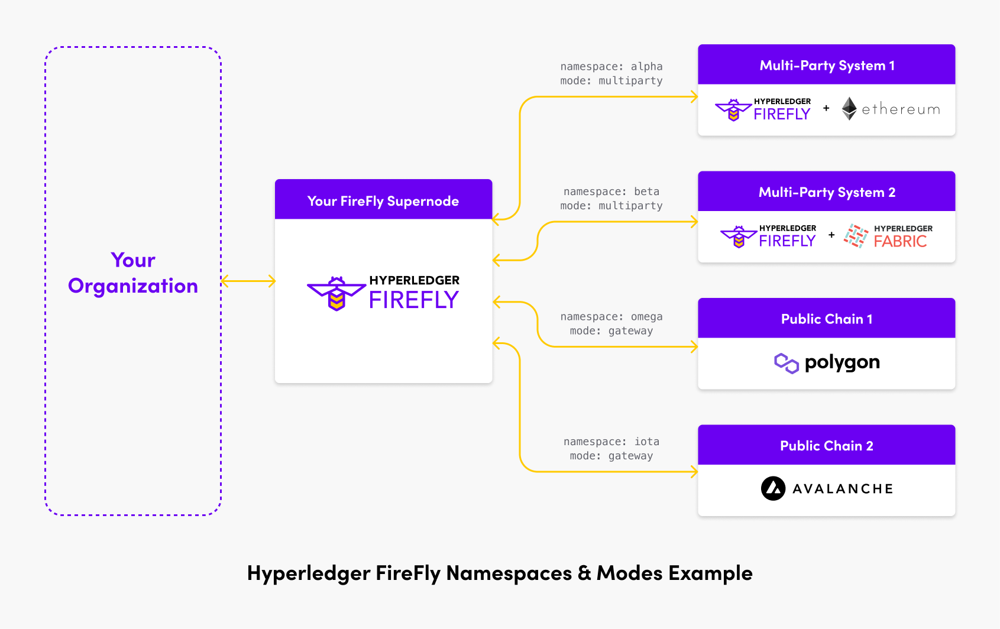
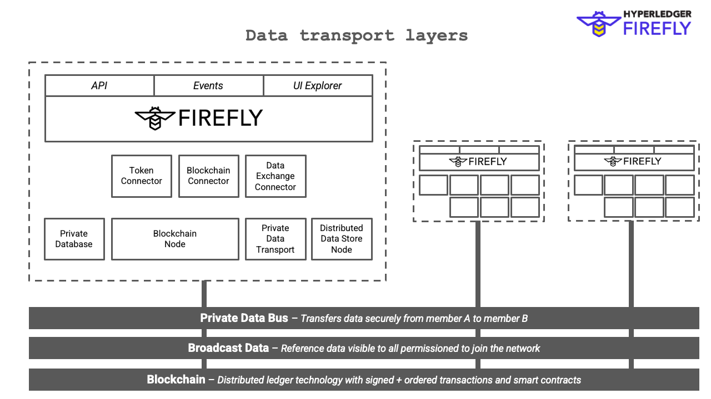

# Security
{: .no_toc }

---

## API Security

Hyperledger FireFly provides a pluggable infrastructure for authenticating API requests.

Each [namespace](../../reference/namespaces.html) can be configured with a different authentication
plugin, such that different teams can have different access to resources on the same
FireFly server.

A reference plugin implementation is provided for HTTP Basic Auth, combined with a `htpasswd`
verification of passwords with a `bcrypt` encoding.

[See this config section for details](../../reference/config.html#pluginsauth), and the
reference implementation
[in Github](https://github.com/hyperledger/firefly-common/blob/main/pkg/auth/basic/basic_auth.go)

> Pre-packaged vendor extensions to Hyperledger FireFly are known to be available, addressing more
> comprehensive role-based access control (RBAC) and JWT/OAuth based security models.

## Data Partitioning and Tenancy

[Namespaces](../../reference/namespaces.html) also provide a data isolation system for different
applications / teams / tenants sharing a Hyperledger FireFly node.

Data is partitioned within the FireFly database by namespace. It is also possible to increase the
separation between namespaces, by using separate database configurations. For example to different
databases or table spaces within a single database server, or even to different database servers.

## Private Data Exchange

FireFly has a pluggable implementation of a private data transfer bus. This transport supports
both structured data (conforming to agreed data formats), and large unstructured data & documents.

A reference microservice implementation is provided for HTTPS point-to-point connectivity with
mutual TLS encryption.

See the reference implementation
[in Github](https://github.com/hyperledger/firefly-dataexchange-https)

> Pre-packaged vendor extensions to Hyperledger FireFly are known to be available, addressing
> message queue based reliable delivery of messages, hub-and-spoke connectivity models, chunking
> of very large file payloads, and end-to-end encryption.

Learn more about these private data flows in [Multiparty Process Flows](../multiparty/multiparty_flow.md).