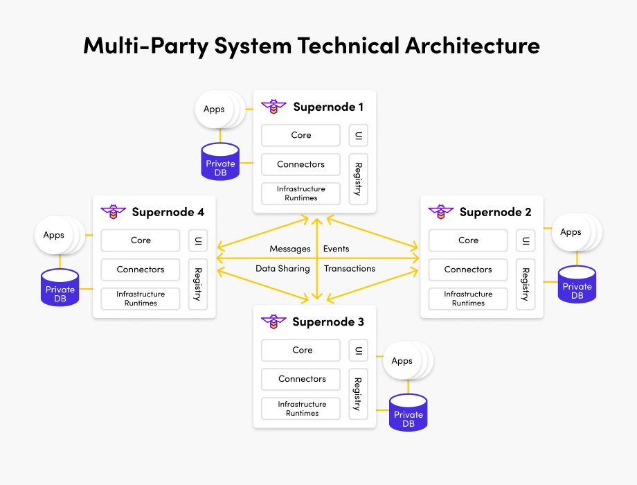

# Usage Patterns
{: .no_toc }

## Table of contents
{: .no_toc .text-delta }

1. TOC
{:toc}

---

There are two modes of usage for Hyperledger Firefly: **Web3 Gateway** and **Multiparty**

> A single runtime can operate in both of these modes, using different [namespaces](../reference/namespaces.md).

## Web3 Gateway Mode

Web3 Gateway mode lets you interact with any Web3 application, regardless of whether Hyperledger FireFly
is being used by other members of your business network.

In this mode you can:
- Transfer tokenized value
- Invoke any other type of smart contract
- Index data from the blockchain
- Reliably trigger events in your applications and back-office core systems
- Manage decentralized data (NFTs etc.)
- Use a _private_ address book to manage signing identities and relationships
- ... and much more

Learn more about [Web3 Gateway Mode](./gateway_features.html).

## Multiparty Mode

Multiparty mode is used to build multi-party systems, with a common application runtime deployed by each enterprise participant.

This allows sophisticated applications to be built, that all use the pluggable APIs of Hyperledger FireFly to achieve
end-to-end business value in an enterprise context.

In this mode you can do everything you could do in Web3 Gateway mode, plus:
- Share and enforce common data formats
- Exchange data privately, via an encrypted data bus
  - Structured JSON data payloads
  - Large documents
- Coordinate on-chain and off-chain data exchange
  - Private data
  - Broadcast data
- Mask on-chain activities using hashes
- Use a _shared_ address book to manage signing identities and relationships
- ... and much more

Learn more about [Multiparty Mode](./multiparty_features.html).
