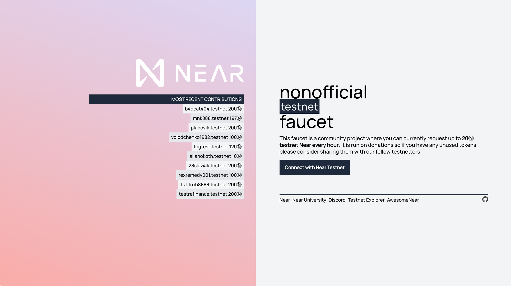
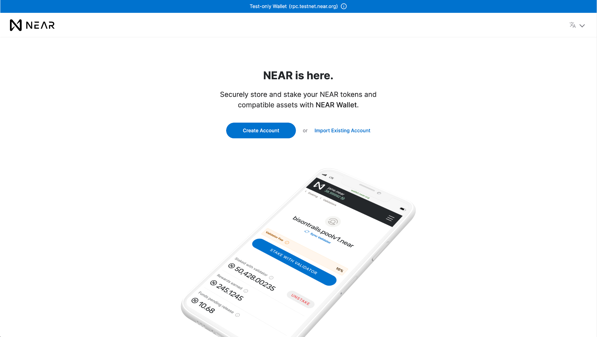
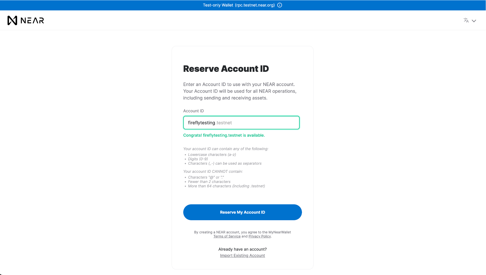
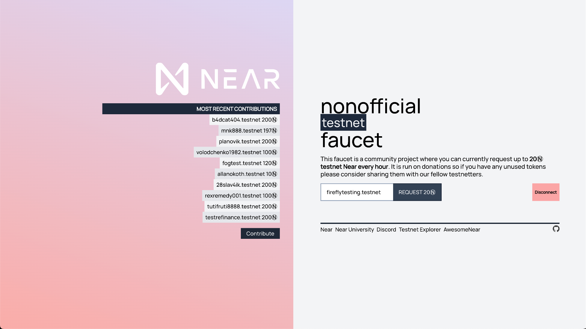
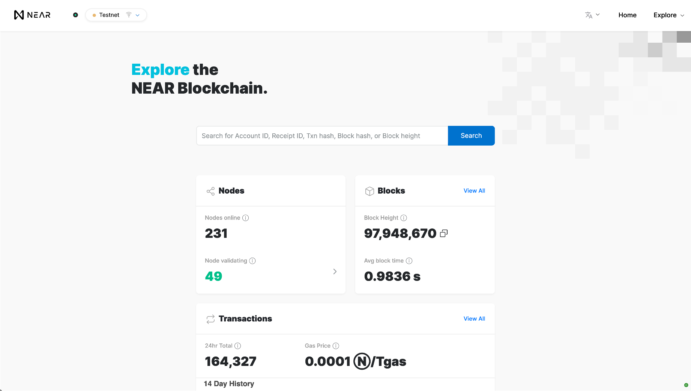
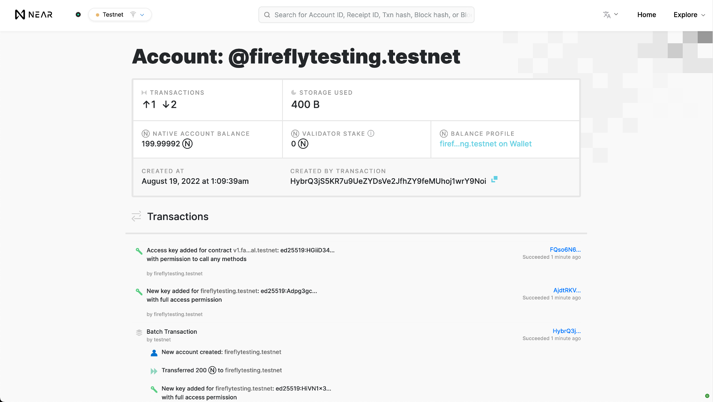
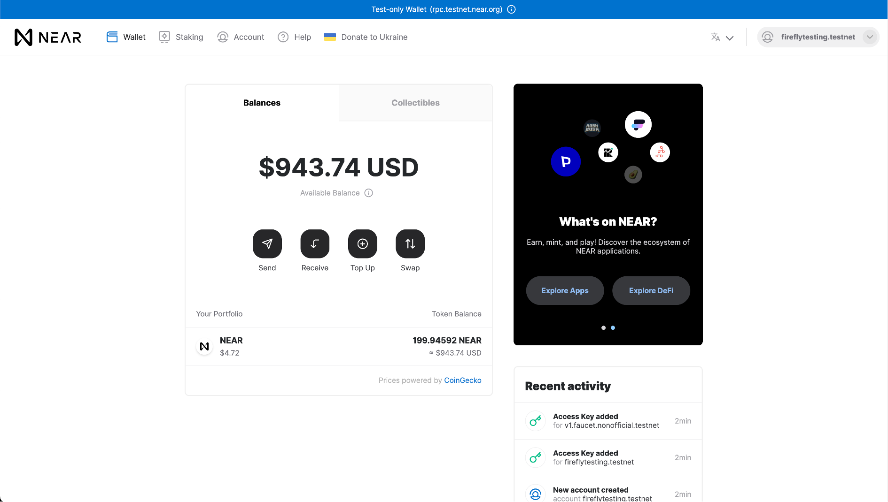

# 
{: .no_toc }

## Table of contents
{: .no_toc .text-delta }

1. TOC
{:toc}

---

Starting with FireFly v1.1, it's easy to connect to public Ethereum chains. This guide will walk you through the steps to create a local FireFly development environment and connect it to the NEAR testnet.

## Previous steps: Install the FireFly CLI

If you haven't set up the FireFly CLI already, please go back to the Getting Started guide and read the section on how to [Install the FireFly CLI](../../gettingstarted/firefly_cli.md).

[← ① Install the FireFly CLI](../../gettingstarted/firefly_cli.md){: .btn .btn-purple .mb-5}

## Create an `evmconnect.yml` config file

In order to connect to the NEAR testnet, you will need to set a few configuration options for the evmconnect blockchain connector. Create a text file called `evmconnect.yml` with the following contents:

```yml
confirmations:
  required: 4
policyengine.simple:
  fixedGasPrice: null
  gasOracle:
    mode: connector
```

For this tutorial, we will assume this file is saved at `~/Desktop/evmconnect.yml`. If your path is different, you will need to adjust the path in the next command below.

## Creating a new stack

To create a local FireFly development stack and connect it to the NEAR testnet, we will use command line flags to customize the following settings:

- Create a new Ethereum based stack named `near` with `1` member
- Disable `multiparty` mode. We are going to be using this FireFly node as a Web3 gateway, and we don't need to communicate with a consortium here
- Use an remote RPC node. This will create a signer locally, so that our signing key never leaves the development machine.
- Set the remote RPC node URL to `https://rpc.testnet.near.org` (RPC nodes for other NEAR networks may be found here https://docs.near.org/api/rpc/setup)
- Set the chain ID to any number (NEAR works with any chain ID)
- Merge the custom config created above with the generated `evmconnect` config file

To do this, run the following command:

```
ff init ethereum near 1 \
    --multiparty=false \
    -n remote-rpc \
    --remote-node-url https://rpc.testnet.near.org \
    --chain-id 1 \
    --connector-config ~/Desktop/evmconnect.yml
```

## Start the stack

Now you should be able to start your stack by running:

```
ff start near
```

After some time it should print out the following:

```
Web UI for member '0': http://127.0.0.1:5000/ui
Sandbox UI for member '0': http://127.0.0.1:5109


To see logs for your stack run:

ff logs near
```

## Get some NEAR

At this point you should have a working FireFly stack, talking to a public chain. However, you won't be able to run any transactions just yet, because you don't have any way to pay for gas. A testnet faucet can give us some NEAR, the native token for the NEAR protocol.

First, you will need to know what signing address your FireFly node is using. To check that, you can run:

```
ff accounts list near
[
  {
    "address": "0xa4ed2a9a99dfdf46f1812c38a1656ff2ad1f61da",
    "privateKey": "..."
  }
]
```

Note, for the NEAR protocol, the line labeled privateKey is the address you will use.

Go to [https://near-faucet.io/](https://near-faucet.io/) and click **Connect with Near Testnet**. Next click **Create Accounte**, make an account ID, and choose a security method. Follow the steps for either the Seedphrase or Ledger Hardware Wallet until your NEAR account is created. Once complete you will be redirected to the original https://near-faucet.io/ page and are now able to request 20 NEAR tokens.






### Confirm the transaction on NEAR Testnet Explorer

Once the request for 20 NEAR tokens is completed, go to [https://explorer.testnet.near.org/](https://explorer.testnet.near.org/) and search via your account name. Once it is found click on the link under **Balance Profile** to access your NEAR wallet. From here, click the **Wallet** button in the top left and then **Send**. Choose a denomination of NEAR to send, enter your 64 character string denominated as privateKey from the FireFly CLI, and you will now have funded tokens in your account.





## Use the public testnet

Now that you have everything set up, you can follow one of the other FireFly guides such as [Using Tokens](../tokens/index.md) or [Custom Smart Contracts](../custom_contracts/ethereum.md). For detailed instructions on deploying a custom smart contract to NEAR, please see the [NEAR docs](https://docs.near.org/develop/contracts/introduction) for instructions using various tools.
