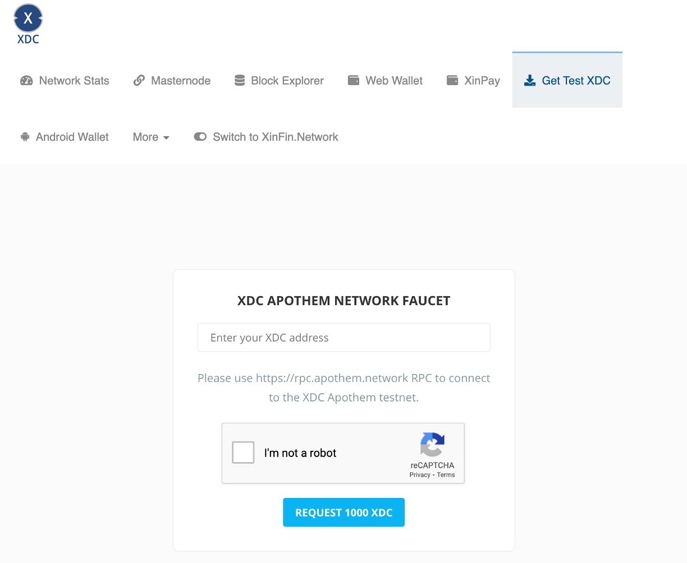
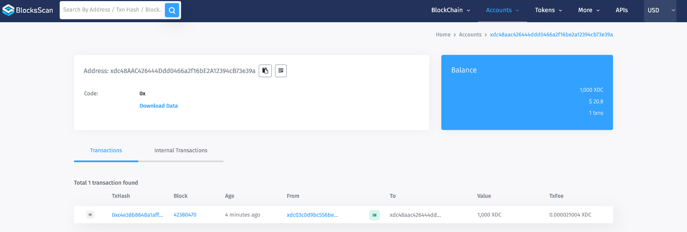

# 
{: .no_toc }

## Table of contents
{: .no_toc .text-delta }

1. TOC
{:toc}

---

Starting with FireFly v1.1, it's easy to connect to public Ethereum chains. This guide will walk you through the steps to create a local FireFly development environment and connect it to the public XDC Apothem Network testnet.

## Previous steps: Install the FireFly CLI
If you haven't set up the FireFly CLI already, please go back to the Getting Started guide and read the section on how to [Install the FireFly CLI](../../gettingstarted/firefly_cli.md).

[← ① Install the FireFly CLI](../../gettingstarted/firefly_cli.md){: .btn .btn-purple .mb-5}

## Create an `evmconnect.yml` config file
In order to connect to the XDC testnet, you will need to set a few configuration options for the evmconnect blockchain connector. Create a text file called `evmconnect.yml` with the following contents:

```yml
confirmations:
    required: 4 # choose the number of confirmations you require
policyengine.simple:
    fixedGasPrice: null
    gasOracle:
        mode: connector
```
For this tutorial, we will assume this file is saved at `~/Desktop/evmconnect.yml`. If your path is different, you will need to adjust the path in the next command below.

## Creating a new stack
To create a local FireFly development stack and connect it to the XDC Apothem testnet, we will use command line flags to customize the following settings:

 - Create a new stack named `xdc` with `1` member
 - Disable `multiparty` mode. We are going to be using this FireFly node as a Web3 gateway, and we don't need to communicate with a consortium here
 - Connect to an ethereum network
 - Use the `evmconnect` blockchain connector
 - Use an remote RPC node. This will create a signer locally, so that our signing key never leaves the development machine.
 - See the list of providers for XDC [docs](https://xinfin.org/xdc-chain-network-tools-and-documents) and select an HTTPS RPC endpoint. Check [Chainlist](https://chainlist.org/chain/51) for the most up to date ChainID and RPC status. For this tutorial we will use https://erpc.apothem.network
 - Set the chain ID to `51` (the correct ID for the XDC Apothem Network testnet)
 - Merge the custom config created above with the generated `evmconnect` config file

To do this, run the following command:
```
ff init xdc 1 \
    --multiparty=false \
    -b ethereum \
    -c evmconnect \
    -n remote-rpc \
    --remote-node-url https://erpc.apothem.network \
    --chain-id 51 \
    --connector-config ~/Desktop/evmconnect.yml
```

## Start the stack
Now you should be able to start your stack by running:

```
ff start xdc
```

After some time it should print out the following:

```
Web UI for member '0': http://127.0.0.1:5000/ui
Sandbox UI for member '0': http://127.0.0.1:5109


To see logs for your stack run:

ff logs xdc
```

## Get some TXDC
At this point you should have a working FireFly stack, talking to a public chain. However, you won't be able to run any transactions just yet, because you don't have any way to pay for gas. A testnet faucet can give us some TXDC, the native token for the XDC Apothem Network.

First, you will need to know what signing address your FireFly node is using. To check that, you can run:

```
ff accounts list xdc
[
  {
    "address": "0x48aac426444ddd0466a2f16be2a12394cb73e39a",
    "privateKey": "..."
  }
]
```

XDC has changed their wallet address [prefix](https://medium.com/xinfin/xinfin-releases-new-address-prefix-starting-with-xdc-75750a444f77) to start with "xdc" instead of "0x".

As such, the address in this tutorial will be ```xdc48aac426444ddd0466a2f16be2a12394cb73e39a```
instead of ```0x48aac426444ddd0466a2f16be2a12394cb73e39a```.

Copy your XDC address and go to the [XDC Apothem Network faucet](https://www.apothem.network/#getTestXDC) and paste the address in the form. Click the **Submit** button, and then **Confirm**.



### Confirm the transaction on the XDC Network BlocksScan Explorer
You should be able to go lookup your account at [https://explorer.apothem.network/](https://explorer.apothem.network/) and see that you now have a balance of 1000 XDC. Simply paste in your account address to search for it.



## Use the public testnet
Now that you have everything set up, you can follow one of the other FireFly guides such as [Using Tokens](../tokens/index.md) or [Custom Smart Contracts](../custom_contracts/ethereum.md). For detailed instructions on deploying a custom smart contract to XDC, please see the [XDC docs](https://howto.xinfin.org/get-started/contract/) for instructions using various tools.