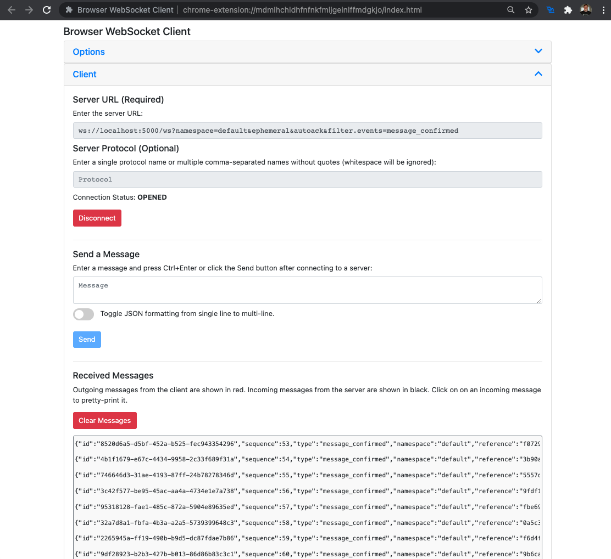

# Listen for events
{: .no_toc }

## Table of contents
{: .no_toc .text-delta }

1. TOC
{:toc}

---

## Quick reference

Probably the most important aspect of FireFly is that it is an _event-driven programming model_.

Parties interact by sending messages and transactions to each other, on and off chain.
Once aggregated and confirmed those events drive processing in the other party.

This allows orchestration of complex multi-party system applications and business processes.

FireFly provides each party with their own private history, that includes all exchanges
outbound and inbound performed through the node into the multi-party system. That includes
blockchain backed transactions, as well as completely off-chain message exchanges.

The event transports are pluggable. The core transports are WebSockets and Webhooks.
We focus on WebSockets in this getting started guide.

> _Check out the Request/Reply section for more information on Webhooks_

## Additional info

- Key Concepts: [Multi-party process flow](../overview/multiparty/multiparty_flow.html)
- Reference: _coming soon_

## WebSockets Example 1: Ephemeral subscription with auto-commit

The simplest way to get started consuming events, is with an ephemeral WebSocket listener.

Example connection URL:

`ws://localhost:5000/ws?namespace=default&ephemeral&autoack&filter.events=message_confirmed`

- `namespace=default` - event listeners are scoped to a namespace
- `ephemeral` - listen for events that occur while this connection is active, but do not remember the app instance (great for UIs)
- `autoack`- automatically acknowledge each event, so the next event is sent (great for UIs)
- `filter.events=message_confirmed` - only listen for events resulting from a message confirmation

There are a number of browser extensions that let you experiment with WebSockets:



## Example event payload

The events (by default) do not contain the payload data, just the `event` and referred `message`.
This means the WebSocket payloads are a predictably small size, and the application can
use the information in the `message` to post-filter the event to decide if it needs to download
the full data.

> _There are server-side filters provided on events as well_

```json
{
  "id": "8f0da4d7-8af7-48da-912d-187979bf60ed",
  "sequence": 61,
  "type": "message_confirmed",
  "namespace": "default",
  "reference": "9710a350-0ba1-43c6-90fc-352131ce818a",
  "created": "2021-07-02T04:37:47.6556589Z",
  "subscription": {
    "id": "2426c5b1-ffa9-4f7d-affb-e4e541945808",
    "namespace": "default",
    "name": "2426c5b1-ffa9-4f7d-affb-e4e541945808"
  },
  "message": {
    "header": {
      "id": "9710a350-0ba1-43c6-90fc-352131ce818a",
      "type": "broadcast",
      "txtype": "batch_pin",
      "author": "0x1d14b65d2dd5c13f6cb6d3dc4aa13c795a8f3b28",
      "created": "2021-07-02T04:37:40.1257944Z",
      "namespace": "default",
      "topic": [
        "default"
      ],
      "datahash": "cd6a09a15ccd3e6ed1d67d69fa4773b563f27f17f3eaad611a2792ba945ca34f"
    },
    "hash": "1b6808d2b95b418e54e7bd34593bfa36a002b841ac42f89d00586dac61e8df43",
    "batchID": "16ffc02c-8cb0-4e2f-8b58-a707ad1d1eae",
    "state": "confirmed",
    "confirmed": "2021-07-02T04:37:47.6548399Z",
    "data": [
      {
        "id": "b3a814cc-17d1-45d5-975e-90279ed2c3fc",
        "hash": "9ddefe4435b21d901439e546d54a14a175a3493b9fd8fbf38d9ea6d3cbf70826"
      }
    ]
  }
}
```

## Download the message and data

A simple REST API is provided to allow you to download the data associated with the message:

`GET` `/api/v1/namespaces/default/messages/{id}?data=true`

## Download just the data array associated with a message

As you already have the message object in the event delivery, you can query just the array
of data objects as follows:

`GET` `/api/v1/namespaces/default/messages/{id}/data`

## WebSockets Example 2: Durable subscription for your application, with manual-commit

To reliably process messages within your application, you should first set up a subscription.

A subscription requests that:
- FireFly keeps a record of the latest event consumed by that application
- FireFly only delivers one copy of the event to the application, even when there are multiple active connections

This should be combined with manual acknowledgment of the events, where the application sends a
payload such as the following in response to each event it receives (where the `id` comes from the event
it received):

```json
{ "type": "ack", "id": "617db63-2cf5-4fa3-8320-46150cbb5372" }
```

> _You must send an acknowledgement for every message, or you will stop receiving messages_.

### Set up the WebSocket subscription

Each subscription is scoped to a namespace, and must have a `name`. You can then choose to perform
server-side filtering on the events using regular expressions matched against the information
in the event.

`POST` `/namespaces/default/subscriptions`

```json
{
  "transport": "websockets",
  "name": "app1",
  "filter": {
    "blockchainevent": {
      "listener": ".*",
      "name": ".*"
    },
    "events": ".*",
    "message": {
      "author": ".*",
      "group": ".*",
      "tag": ".*",
      "topics": ".*"
    },
    "transaction": {
      "type": ".*"
    }
  },
  "options": {
    "firstEvent": "newest",
    "readAhead": 50
  }
}
```

### Connect to consume messages

Example connection URL:

`ws://localhost:5000/ws?namespace=default&name=app1`

- `namespace=default` - event listeners are scoped to a namespace
- `name=app1` - the subscription name


## Custom Contract Events

If you are interested in learning more about events for custom smart contracts, please see the [Working with custom smart contracts](./custom_contracts/index.md) section.
