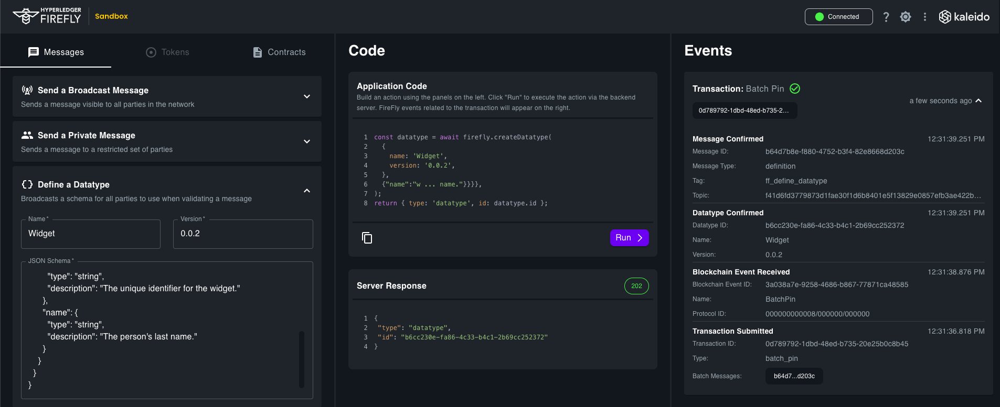
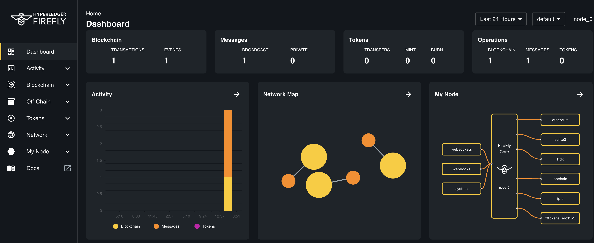

# Privately send data
{: .no_toc }

## Table of contents
{: .no_toc .text-delta }

1. TOC
{:toc}

---

## Quick reference

- Sends a `message` to a restricted set of parties
  - The message describes who sent it, to whom, and exactly what data was sent
- A `message` has one or more attached pieces of business `data`
  - Can be sent in-line, uploaded in advanced, or received from other parties
  - Can include smaller JSON payloads suitable for database storage
    - These can be verified against a `datatype`
  - Can include references to large (multi megabyte/gigabyte) Blob data
- A `group` specifies who has visibility to the data
  - The author must be included in the group - auto-added if omitted
  - Can be specified in-line in the message by listing recipients directly
  - Can be referred to by hash
- Private sends are _optionally_ sequenced via pinning to the blockchain
  - If the send is pinned:
    - The blockchain does not contain any data, just a hash pin
      - Even the ordering context (topic) is obscured in the on-chain data
      - This is true regardless of whether a restricted set of participants
        are maintaining the ledger, such as in the case of a Fabric Channel.
    - The message should not be considered confirmed (even by the sender) until it
      has been sequenced via the blockchain and a `message_confirmed` event occurs
    - Batched for efficiency
      - One `batch` can pin hundreds of private `message` sends
      - The batch flows privately off-chain from the sender to each recipient
  - If the send is unpinned:
    - No data is written to the blockchain at all
    - The message is marked confirmed immediately
      - The sender receives a `message_confirmed` event immediately
    - The other parties in the group get `message_confirmed` events as soon as the data arrives

## Additional info

- Key Concepts: [Private data exchange](../overview/multiparty/data_exchange.html)
- Swagger: <a href="../swagger/swagger.html#/Default%20Namespace/postNewMessagePrivate" data-proofer-ignore>POST /api/v1/namespaces/{ns}/messages/private</a>

## Example 1: Pinned private send of in-line string data

`POST` `/api/v1/namespaces/default/messages/private`

```json
{
  "data": [
    {
      "value": "a string"
    }
  ],
  "group": {
    "members": [
      {
        "identity": "org_1"
      }
    ]
  }
}
```

## Example message response

Status: `202 Accepted` - the message is on it's way, but has not yet been confirmed.

```json
{
  "header": {
    "id": "c387e9d2-bdac-44cc-9dd5-5e7f0b6b0e58", // uniquely identifies this private message
    "type": "private", // set automatically
    "txtype": "batch_pin", // message will be batched, and sequenced via the blockchain
    "author": "0x0a65365587a65ce44938eab5a765fe8bc6532bdf", // set automatically in this example to the node org
    "created": "2021-07-02T02:37:13.4642085Z", // set automatically
    "namespace": "default", // the 'default' namespace was set in the URL
    // The group hash is calculated from the resolved list of group participants.
    // The first time a group is used, the participant list is sent privately along with the
    // batch of messages in a `groupinit` message.
    "group": "2aa5297b5eed0c3a612a667c727ca38b54fb3b5cc245ebac4c2c7abe490bdf6c",
    "topics": [
      "default" // the default topic that the message is published on, if no topic is set
    ],
    // datahash is calculated from the data array below
    "datahash": "24b2d583b87eda952fa00e02c6de4f78110df63218eddf568f0240be3d02c866"
  },
  "hash": "423ad7d99fd30ff679270ad2b6b35cdd85d48db30bafb71464ca1527ce114a60", // hash of the header
  "state": "ready", // this message is stored locally but not yet confirmed
  "data": [
    // one item of data was stored
    {
      "id": "8d8635e2-7c90-4963-99cc-794c98a68b1d", // can be used to query the data in the future
      "hash": "c95d6352f524a770a787c16509237baf7eb59967699fb9a6d825270e7ec0eacf" // sha256 hash of `"a string"`
    }
  ]
}
```

## Example 2: Unpinned private send of in-line string data

Set `header.txtype: "none"` to disable pinning of the private message send to the blockchain.
The message is sent immediately (no batching) over the private data exchange.

`POST` `/api/v1/namespaces/default/messages/private`

```json
{
  "header": {
    "txtype": "none"
  },
  "data": [
    {
      "value": "a string"
    }
  ],
  "group": {
    "members": [
      {
        "identity": "org_1"
      }
    ]
  }
}
```

## Example 3: Inline object data to a topic (no datatype verification)

It is very good practice to set a `tag` and `topic` in each of your messages:

- `tag` should tell the apps receiving the private send (including the local app), what
  to do when it receives the message. Its the reason for the send - an
  application specific type for the message.
- `topic` should be something like a well known identifier that relates to the
  information you are publishing. It is used as an ordering context, so all
  sends on a given topic are assured to be processed in order.

`POST` `/api/v1/namespaces/default/messages/private`

```json
{
  "header": {
    "tag": "new_widget_created",
    "topics": ["widget_id_12345"]
  },
  "group": {
    "members": [
      {
        "identity": "org_1"
      }
    ]
  },
  "data": [
    {
      "value": {
        "id": "widget_id_12345",
        "name": "superwidget"
      }
    }
  ]
}
```

## Notes on why setting a topic is important

The FireFly aggregator uses the `topic` (obfuscated on chain) to determine if a
message is the next message in an in-flight sequence for any groups the node is
involved in. If it is, then that message must receive all off-chain private data
and be confirmed before any subsequent messages can be confirmed on the same sequence.

So if you use the same topic in every message, then a single failed send on one
topic blocks delivery of all messages between those parties, until the missing
data arrives.

Instead it is best practice to set the topic on your messages to value
that identifies an ordered stream of business processing. Some examples:

- A long-running business process instance identifier assigned at initiation
- A real-world business transaction identifier used off-chain
- The agreed identifier of an asset you are attaching a stream of evidence to
- An NFT identifier that is assigned to an asset (digital twin scenarios)
- An agreed primary key for a data resource being reconciled between multiple parties

The `topic` field is an array, because there are cases (such as merging two identifiers)
where you need a message to be deterministically ordered across multiple sequences.
However, this is an advanced use case and you are likely to set a single topic
on the vast majority of your messages.

## Example 3: Upload a blob with metadata and send privately

Here we make two API calls.

1) Create the `data` object explicitly, using a multi-part form upload
- You can also just post JSON to this endpoint

2) Privately send a message referring to that data
- The Blob is sent privately to each party
- A pin goes to the blockchain
- The metadata goes into a batch with the message

### Multipart form post of a file

Example curl command (Linux/Mac) to grab an image from the internet,
and pipe it into a multi-part form post to FireFly.

> _Note we use `autometa` to cause FireFly to automatically add
> the `filename`, and `size`, to the JSON part of the `data` object for us._

```sh
curl -sLo - https://github.com/hyperledger/firefly/raw/main/docs/firefly_logo.png \
 | curl --form autometa=true --form file=@- \
   http://localhost:5000/api/v1/namespaces/default/data
```

### Example data response from Blob upload

Status: `200 OK` - your data is uploaded to your local FireFly node

At this point the data has not be shared with anyone else in the network

```json
{
  // A uniquely generated ID, we can refer to when sending this data to other parties
  "id": "97eb750f-0d0b-4c1d-9e37-1e92d1a22bb8",
  "validator": "json", // the "value" part is JSON
  "namespace": "default", // from the URL
  // The hash is a combination of the hash of the "value" metadata, and the
  // hash of the blob
  "hash": "997af6a9a19f06cc8a46872617b8bf974b106f744b2e407e94cc6959aa8cf0b8",
  "created": "2021-07-01T20:20:35.5462306Z",
  "value": {
    "filename": "-", // dash is how curl represents the filename for stdin
    "size": 31185 // the size of the blob data
  },
  "blob": {
    // A hash reference to the blob
    "hash": "86e6b39b04b605dd1b03f70932976775962509d29ae1ad2628e684faabe48136"
  }
}
```

### Send the uploaded data privately

Just include a reference to the `id` returned from the upload.

`POST` `/api/v1/namespaces/default/messages/private`

```json
{
  "data": [
    {
      "id": "97eb750f-0d0b-4c1d-9e37-1e92d1a22bb8"
    }
  ],
  "group":{
      "members": [
        {
          "identity":"org_1"
        }
      ]
    }
}
```

## Sending Private Messages using the Sandbox
All of the functionality discussed above can be done through the [FireFly Sandbox](../gettingstarted/sandbox.md).

To get started, open up the Web UI and Sanbox UI for at least one of your members. The URLs for these were printed in your terminal when you started your FireFly stack.

Make sure to expand the "Send a Private Message" section. Enter your message into the message field as seen in the screenshot below. Because we are sending a private message, make sure you're in the "Send a Private Message" section and that you choose a message recipient


Notice how the `data` field in the center panel updates in real time as you update the message you wish to send.

Click the blue `Run` button. This should return a `202` response immediately in the Server Response section and will populate the right hand panel with transaction information after a few seconds.



Go back to the FireFly UI (the URL for this would have been shown in the terminal when you started the stack) and you'll see your successful blockchain transaction. Compare the "Recent Network Changes" widget With private messages, your

